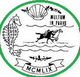

# T1 - 50 points

**[⬆ to writups](../../README.md)**

## Description

Find a favorite author of a person who bought a new house in 2020. Submit Author's full name as a flag: flag{NameSurname}. For example, if it is Alexandr Pushkin flag will be flag{AlexandrPushkin}

  
<b>Open hint</b>

   search engines are the best tools in OSINT. 

And we have the picture:

## Solution

1.  Search by this picture gets us the City of **Del Mar**
2.  Then we can find famous people who own a house in Del Mar
    
3.  If we investigate Bill Gates's pictures we can find year he bought this house - **2020**. Now we have found the person
4.  The favorite author of Bill Gates we find with google. He is Vaclav Smil. - **flag{VaclavSmil}**
